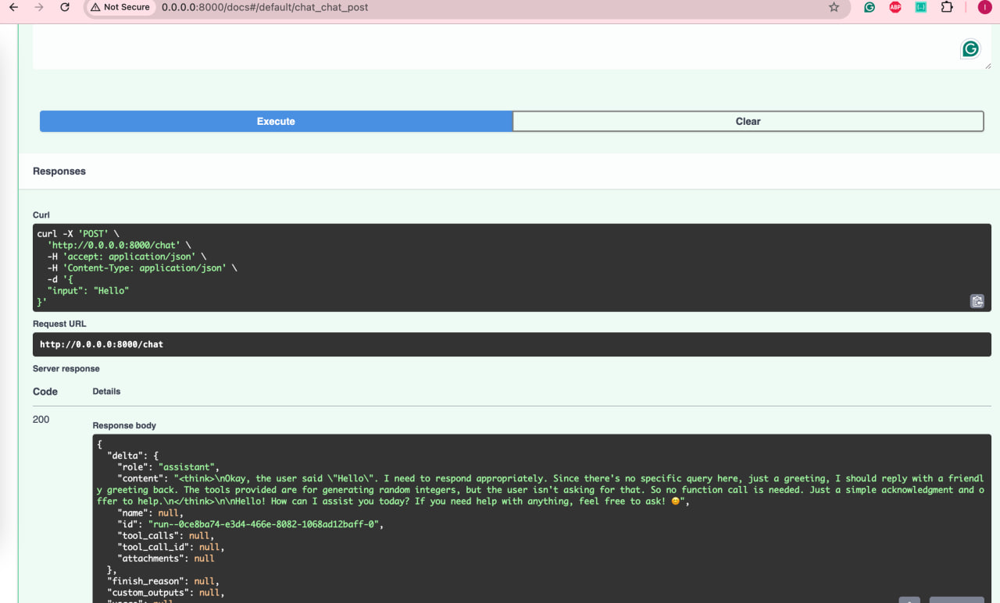
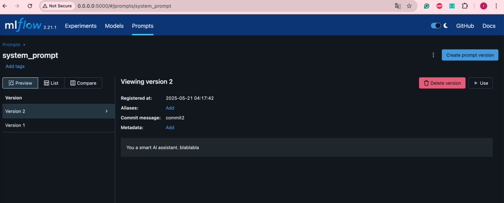
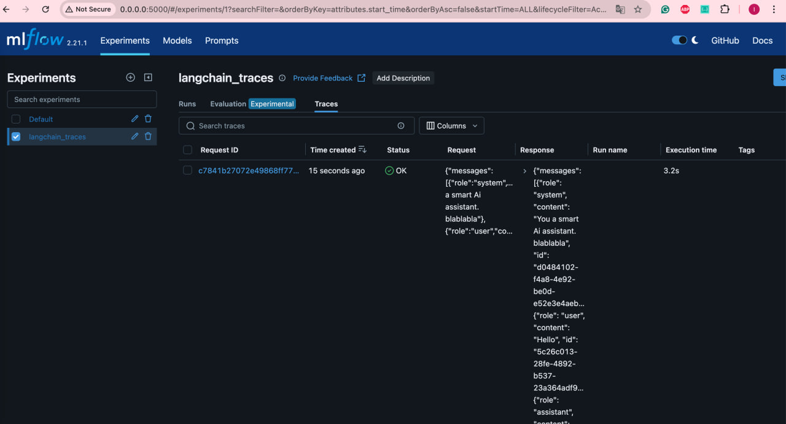
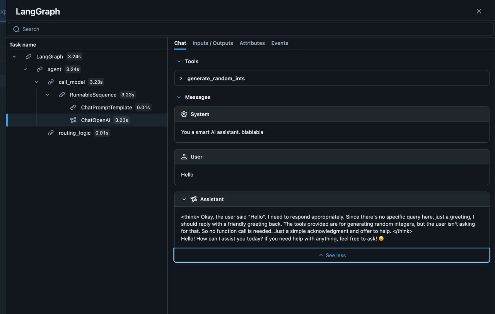
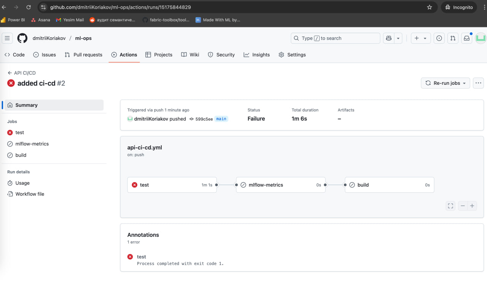
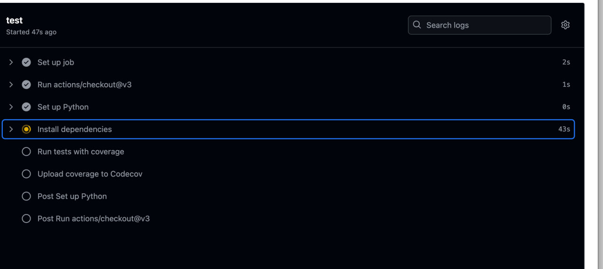
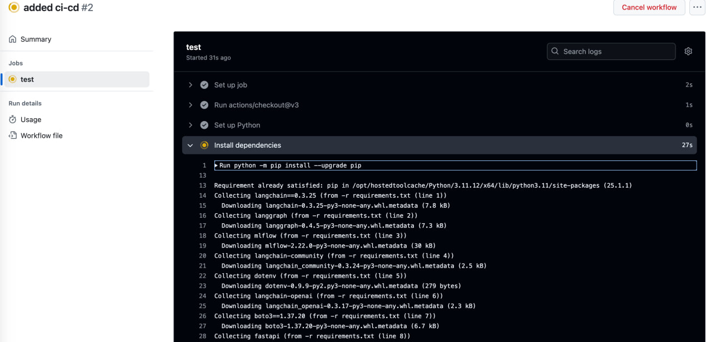

# Проект MLOps

Этот репозиторий содержит проект по машинному обучению и MLOps, который демонстрирует интеграцию различных инструментов и технологий для построения, деплоя и мониторинга ML-приложений.

## Содержание

- [Terraform S3 Manifest для Яндекс Облака](#terraform-s3-manifest-для-яндекс-облака)
- [Настройка сервера MLFlow](#настройка-сервера-mlflow)
- [CI/CD Pipeline с интеграцией MLFlow](#cicd-pipeline-с-интеграцией-mlflow)

## Terraform S3 Manifest для Яндекс Облака

В проекте есть Terraform-манифест, который создаёт S3-совместимый storage bucket в Яндекс Облаке. Конфигурация Terraform разделена на несколько файлов для удобства поддержки и разделения ответственности:

### Структура файлов

- **manifest.tf**: Основные ресурсы для создания S3 bucket:
  - Сервисный аккаунт с ролью storage.editor
  - Статические access-ключи для сервисного аккаунта
  - Генератор случайных ID для уникальных имён bucket-ов
  - S3-совместимый storage bucket с приватным доступом

- **providers.tf**: Настройка Yandex Cloud провайдера:
  - Указание версии провайдера
  - Конфигурирование через переменные

- **variables.tf**: Описание переменных:
  - `yc_iam_token`: IAM токен для аутентификации в Яндекс Облаке (чувствительный)
  - `yc_cloud_id`: Cloud ID в Яндекс Облаке
  - `yc_folder_id`: Folder ID в Яндекс Облаке

### Ключевые особенности

- **Модульная структура**: Конфиг разделён на отдельные файлы для ресурсов, провайдеров и переменных — это упрощает поддержку.
- **Безопасность**: Чувствительные данные, такие как токены, помечены как sensitive и не выводятся в логах.
- **Уникальные имена**: Используются random id для генерации уникальных имён bucket-ов.
- **Контроль доступа**: Bucket создаётся с приватным ACL для безопасности.

## Настройка сервера MLFlow

Проект включает полноценную настройку MLFlow server для трекинга экспериментов, реестра моделей и мониторинга метрик.

### Компоненты

- **MLFlow сервер**: Контейнеризированный MLFlow сервер:
  - PostgreSQL для хранения метаданных
  - S3-совместимое хранилище (MinIO) для артефактов
  - Кастомный Docker-образ на базе `mlflow/Dockerfile`

- **Интеграция с приложением**: Приложение FastAPI настроено для работы с MLFlow:
  - Трекинг экспериментов
  - Логирование метрик
  - Сервинг моделей

### Docker Compose

Файл `docker-compose.yml` управляет всей инфраструктурой MLFlow:

- **MinIO**: S3-совместимое хранилище для артефактов
- **PostgreSQL**: База данных для MLFlow метаданных
- **MLFlow Server**: Основной сервер
- **API Service**: Приложение FastAPI, интегрированное с MLFlow

### Преимущества MLFlow

1. **Трекинг экспериментов**: MLFlow автоматически отслеживает параметры, метрики и артефакты — удобно сравнивать разные модели и запуски.
2. **Реестр моделей**: Централизованный реестр с поддержкой версионности и стадий (development, staging, production).
3. **Воспроизводимость**: Все параметры и зависимости сохраняются, обеспечивая воспроизводимость.
4. **Визуализация метрик**: UI MLFlow позволяет анализировать метрики моделей.
5. **Интеграция с CI/CD**: Как видно в GitHub Actions, MLFlow интегрирован в пайплайн для трекинга тестов и производительности.
6. **Масштабируемость**: Использование PostgreSQL и S3 позволяет масштабировать проект.

## CI/CD Pipeline с интеграцией MLFlow

В проекте настроен GitHub Actions workflow, реализующий CI/CD pipeline с MLFlow.

### Этапы пайплайна

1. **Test**: Запуск юнит-тестов с покрытием
2. **MLFlow Metrics**: Расчёт и логирование метрик в MLFlow
3. **Build and Deploy**: Сборка и публикация Docker-образа в GitHub Container Registry

### Интеграция MLFlow в CI/CD

В задаче `mlflow-metrics` (GitHub Actions):

- Создаётся MLFlow эксперимент "api_service_metrics"
- Запускаются тесты и логируются такие метрики как:
  - Количество запущенных тестов
  - Количество прошедших тестов
  - Количество проваленных тестов
  - Количество тестов с ошибками
  - Процент успешных тестов

Это позволяет отслеживать динамику тестирования и вовремя выявлять регрессии.

### Локальное тестирование

Для локального запуска есть скрипт `test_local.sh`, чтобы запускать те же тесты и логи метрик локально, как и в CI/CD.

## Заключение

Этот проект — пример полного MLOps цикла с:

- Infrastructure as Code через Terraform для S3-хранилища
- Трекинг экспериментов и моделей через MLFlow
- CI/CD pipeline с трекингом метрик

Комбинация этих инструментов создаёт надёжную инфраструктуру для разработки, деплоя и мониторинга ML-приложений.